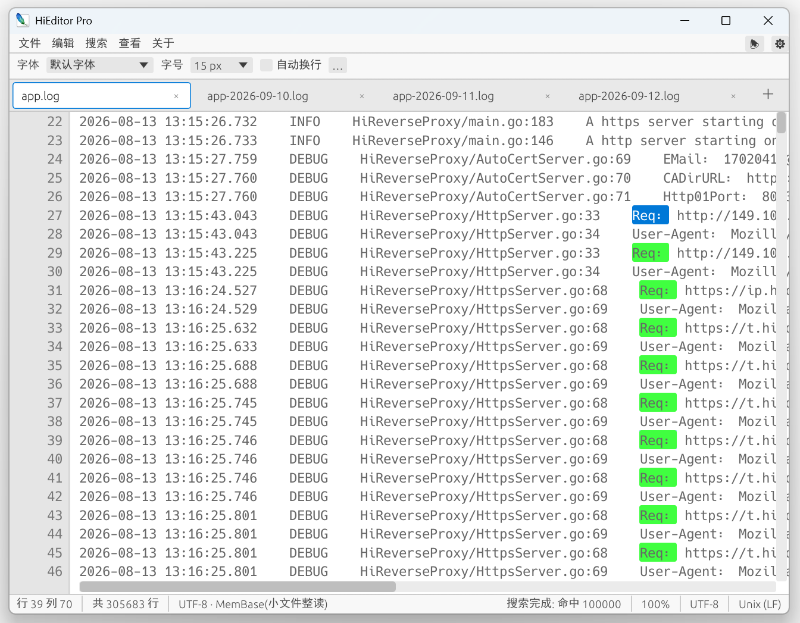

# HiEditor Pro

**Windows 平台 GB 级大文件文本编辑器 — 秒开 · 毫秒级全文件搜索 · 流畅编辑**

A GB-scale text editor for Windows — instant open, millisecond full-file search, smooth editing.

 

HiEditor Pro 是一款免费的对标 EmEditor 的 Windows 大文件文本编辑器，
GB 级文件毫秒级打开、全文件搜索秒级完成、编辑操作与文件大小无关——
单 exe 约 3 MB，无安装、无依赖。

注：本工具推荐在 Win10 或以上平台运行。

## ✨ 功能特性

### 大文件内核

- **秒开 GB 级文件**：mmap 只读基座 + OS 按需页加载，打开 5GB 文件 0ms（映射即返回），
  首屏立即渲染，行索引后台多线程构建，右上角实时显示进度
- **两级块状行索引**：~4096 行/块，块内 u32 间距存储（>4GB 行自动升级 u64），
  二分跳行 O(log n)；编辑后只重建受影响块，Arc 写时复制支持后台线程无锁快照
- **SIMD 并行搜索**：`memchr::memmem`（AVX2 加速）+ 按行界分块多线程扫描，
  结果携带 `(行号, 字节偏移, 长度)`，命中达上限提前终止，后台线程可取消
- **流畅编辑**：piece table 增量层，编辑耗时与文件大小无关（5GB 文件单次编辑 ~0.3ms），
  命令式撤销/重做，全部替换为整批撤销单元
- **三后端存储自动选择**：小文件整读（≤300MB）/ 本地大文件内存映射 / 网络盘与可移动介质分块读，
  按介质类型自动切换
- **GBK/GB2312 完整支持**：自动检测、中文渲染、中文输入/光标/选区、按编码搜索替换，
  保存保持原编码不变；字节级管线保证大文件架构不受影响

### 图形界面

- **多标签页**：独立缓冲/光标/滚动/搜索状态，拖拽排序，右键菜单（关闭/关闭其他/复制路径…）
- **完整编辑能力**：光标与选区（点击/拖选/双击选词/三击选行/Shift 扩展）、中文输入法（IME）、
  剪贴板（Ctrl+C/X/V/A）、撤销重做（Ctrl+Z/Y）、大小写转换、右键上下文菜单
- **查找与替换**（Ctrl+F / Ctrl+H）：后台并行搜索、命中高亮、Enter 逐个跳转、
  区分大小写、全词匹配、单次替换（增量修正命中表，无需重扫）、全部替换（整批可撤销）
- **虚拟化渲染**：只绘制可视区行，滚动流畅度与文件大小无关；支持自动换行（按视觉行滚动）
  与水平滚动
- **打印**（Ctrl+P）：Windows 标准打印对话框，支持 全部/页码区间/选定内容/当前页，
  后台假脱机不卡界面，GB 级文件范围保护（上限 20,000 页）
- **自定义字体**：`fonts` 目录放入 `.ttf/.otf/.ttc` 即自动识别字体家族名（解析字体内部
  name 表，中文名可正确显示）
- **双主题**：浅色/深色模式，长时间工作保护眼睛。
- **中英双语**：界面语言 中文/English/跟随系统，设置持久化
- **文件管理**：拖放文件打开、最近文件（持久化 20 条）、命令行参数直接打开、
  创建桌面快捷方式
- **状态栏**：行列位置 / 总行数 / 编码 / 存储后端 / 索引进度 / 未保存标记 / 换行风格

